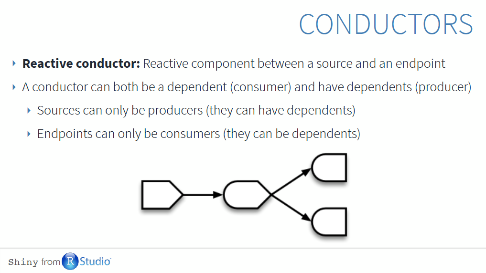

```{r setup, include=FALSE}
knitr::opts_chunk$set(echo = FALSE)

```

## Resources
* [2018 workshop materials](https://github.com/jcheng5/shiny-training-rstudioconf-2018)
* [2016 developer conference](https://www.rstudio.com/resources/webinars/shiny-developer-conference/)
* Upcoming EcoDataSci Workshop - Intro to Shiny with Ben Best - April 4, 2018
  + [Scaling Shiny apps with async programming](https://www.rstudio.com/resources/videos/scaling-shiny-apps-with-async-programming/)
  - [Developing robust shiny apps with regression testing](https://www.rstudio.com/resources/videos/developing-robust-shiny-apps-with-regression-testing/)
  + [Make Shiny fast by doing as little work as possible](https://www.rstudio.com/resources/videos/make-shiny-fast-by-doing-as-little-work-as-possible/)
  + [Scaling Shiny](https://www.rstudio.com/resources/videos/scaling-shiny/)
  + [Rapid prototyping data products using Shiny](https://www.rstudio.com/resources/videos/rapid-prototyping-data-products-using-shiny/)
 + [Developing and deploying large scale Shiny applications](https://www.rstudio.com/resources/videos/developing-and-deploying-large-scale-shiny-applications/)

## What is Shiny?

https://github.com/jcheng5/shiny-training-rstudioconf-2018/blob/master/slides/01-fast-intro.pdf

## What is Shiny?

https://github.com/jcheng5/shiny-training-rstudioconf-2018/blob/master/slides/01-fast-intro.pdf

## What is Shiny good for?
- Data exploration / report generation tools for partners
- Dashboards / database frontends
- Interactive models for discussions with partners, decision-makers
- Data analysis tools
- Supplementary material for publications
- Others??

## Anatomy of a Shiny app

https://github.com/jcheng5/shiny-training-rstudioconf-2018/blob/master/slides/01-fast-intro.pdf

## Reactivity

https://github.com/jcheng5/shiny-training-rstudioconf-2018/blob/master/slides/02-reactive-prog-pt1.pdf

## Reactivity

https://github.com/jcheng5/shiny-training-rstudioconf-2018/blob/master/slides/02-reactive-prog-pt1.pdf

## Reactivity

https://github.com/jcheng5/shiny-training-rstudioconf-2018/blob/master/slides/02-reactive-prog-pt1.pdf

## Reactivity

https://github.com/jcheng5/shiny-training-rstudioconf-2018/blob/master/slides/02-reactive-prog-pt1.pdf

## Reactivity

https://github.com/jcheng5/shiny-training-rstudioconf-2018/blob/master/slides/04-adv-react.pdf

## Reactivity

https://github.com/jcheng5/shiny-training-rstudioconf-2018/blob/master/slides/02-reactive-prog-pt1.pdf

## Improving your UI

https://github.com/jcheng5/shiny-training-rstudioconf-2018/blob/master/slides/03-understanding-ui.pdf

## Improving your UI

https://github.com/jcheng5/shiny-training-rstudioconf-2018/blob/master/slides/03-understanding-ui.pdf

## Improving your UI

https://github.com/jcheng5/shiny-training-rstudioconf-2018/blob/master/slides/03-understanding-ui.pdf

## Improving your UI
- [shinythemes](https://github.com/rstudio/shinythemes) – modify color of default shiny objects
- [shinydashboard](http://rstudio.github.io/shinydashboard/) – Snazzy dashboards
- [shinymaterial](https://ericrayanderson.github.io/shinymaterial/) - Utilize Google's design standards (Materialize CSS)
- [shinyBS](https://github.com/ebailey78/shinyBS) – adds little things shiny doesn’t come prepackaged with, i.e., tooltips
- [shinyjs](https://github.com/daattali/shinyjs) - adds javascript features
- [shinytoastr](https://github.com/MangoTheCat/shinytoastr) – popup notification messages
- [miniUI](https://github.com/rstudio/miniUI) – build UIs specifically for mobile devices
- [wellPanel](https://shiny.rstudio.com/articles/layout-guide.html) - Fixed, hovering panels in UI
- [Drill down reporting](https://github.com/bborgesr/rstudio-conf-2018)
- [bookmarking states](https://shiny.rstudio.com/articles/bookmarking-state.html) - bookmark selected inputs and tabs
- [htmltools](https://github.com/rstudio/htmltools) - use R programming commands to generate HTML

## Debugging
- Nice overview: https://shiny.rstudio.com/articles/debugging.html
- Break apart complicated processing logistic into understandable and testable chunks
- Don’t do processing/computation inside render functions - put all this into a separate reactive expression
- [modules](https://shiny.rstudio.com/articles/modules.html) - Reuse chunks of commonly used UI and server code
- print and renderPrint
- browser(), conditional statement + browser()
- break points
- [showcase display mode](https://shiny.rstudio.com/articles/display-modes.html)

## Performance improvements
- Pre-process as much as possible. If you must, process in global instead of server.
- [Profiling and performance](https://www.rstudio.com/resources/videos/profiling-and-performance/) - Nice overview
- [Profvis](https://rstudio.github.io/profvis/examples.html#example-3---profiling-a-shiny-application) - Interactive visualizations for profiling code
- [shinytest](https://github.com/rstudio/shinytest) - Test shiny app functionality
- [async programming using promises](https://rstudio.github.io/promises/) - Asynchronous programming - start a long operation, but don't need to wait around for results
